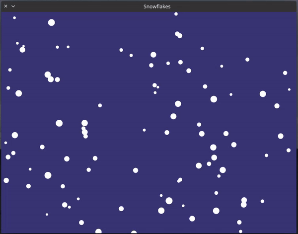

# Snowflakes



This project is part of my boredum in quarantine, so I have to learn something new (Rust language) and then implement it with something fun!

Ikr, _nothing fancy_ here. My first attempt with Rust tho.

## How to
**build**
```
cargo build --release
```

**run**
```
cargo run --release
```
_Considering to use release mode._

### Notes
If somebody or myself in the future wondering why I wrote this code:
```rust
pub struct Snowflakes {
    capacity: usize,
    radius: Vec<f64>,
    velocity: Vec<f64>,
    x: Vec<f64>,
    y: Vec<f64>,
}

pub struct Snowflake {
    pub id: usize,
    pub radius: f64,
    pub velocity: f64,
    pub x: f64,
    pub y: f64,
}
```

here is my explanation, first the struct `Snowflakes` is implement the SoA pattern. I'm not sure if it will perform well on heap allocation (those vectors). I want to use something like [FixedSizeArray](https://doc.rust-lang.org/beta/core/array/trait.FixedSizeArray.html) in the future if it's finally arrive as the stable features.

Lastly, the struct `Snowflake` is just a template for me to manipulate the data that I got from `Snowflakes` to more specific.
